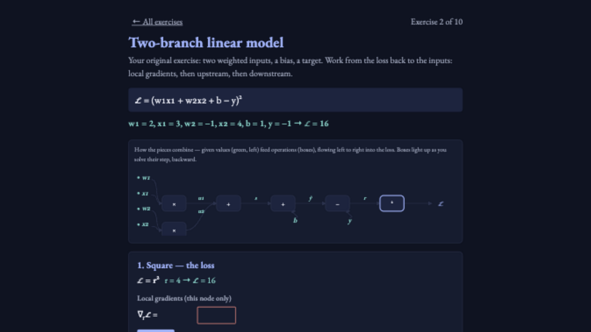

# 5190-practice

[](https://github.com/causius0/5190-practice/actions/workflows/validate.yml)
[](https://5190-practice.vercel.app)

Interactive backpropagation practice — 10 exercises that walk you from a single product-and-square up to a mini-batch with shared parameters, plus exam flashcards: 24 past-exam questions grouped by topic, click to reveal the official answers. Built as practice for CIS 5190 (Applied Machine Learning).

**Live: https://5190-practice.vercel.app**



## The exercises

| # | Loss | New idea |
|---|------|----------|
| 1 | ℒ = (wx)² | warm-up: one product, one square |
| 2 | ℒ = (w₁x₁ + w₂x₂ + b − y)² | two-branch linear model |
| 3 | ℒ = (σ(wx + b) − y)² | sigmoid gate: σ′ = σ(1 − σ) |
| 4 | ℒ = (max(0, wx + b) − y)² | ReLU: pass or block |
| 5 | ℒ = (1/(wx + b) − y)² | reciprocal: −1/t² sign flip |
| 6 | ℒ = (w₁x · w₂x)² | shared input: gradients sum over paths |
| 7 | ℒ = (w₂σ(w₁x + b₁) + b₂ − y)² | one-hidden-layer network |
| 8 | ℒ = max(0, 1 − y(wx + b)) | SVM hinge loss |
| 9 | ℒ = −[y log σ(z) + (1−y) log(1−σ(z))] | logistic regression + cross-entropy |
| 10 | ℒ = ½[(wx₁ + b − y₁)² + (wx₂ + b − y₂)²] | mini-batch: shared w, b accumulate shares |

## How practice works

- Each exercise shows its equation and a **computation graph** of how the pieces combine, from given values to the loss.
- You work **backward, node by node**: first the local gradients (this node only), then the upstream gradient coming back from the loss, then the downstream gradients (local × upstream).
- A node unlocks when the one to its right is done.
- **Wrong answers teach**: the first miss gets a targeted hint showing the calculation; a second miss unlocks *Show answer*, which fills in the solution and explains how each value is computed.
- Shared symbols (an input feeding two branches, a weight serving two data points) are tagged *(this branch)* — the final summary sums the shares.
- Progress is saved in your browser.

## Exam flashcards

24 questions from past CIS 4190/5190 exams (Midterm 1 Fall 2025, Midterm 1 Fall 2024, Final Fall 2022), grouped into 8 topics: logistic regression, neural networks, bias–variance, kNN, linear regression, backpropagation, regularization, and train/val/test splits. Click a question to reveal its answer (the official solutions, verified against the source PDFs), or reveal a whole topic at once.

## Repo layout

- `index.html` — the entire app. Single file, no dependencies; exercise and flashcard data live inline between `//__DATA__` markers.
- `scripts/verify.mjs` — replays the chain rule over every exercise's gradient data. Run it with `node scripts/verify.mjs`.
- `.github/workflows/validate.yml` — runs that check on every push and PR.

## Adding or editing exercises

Edit the data block in `index.html` (each node declares its formula, forward values, upstream gradient, and per-input local gradients with hints), then run:

```bash
node scripts/verify.mjs
```

It recomputes the whole backward pass from your local gradients and fails loudly if any upstream or downstream value doesn't follow from the chain rule. CI runs the same check, and `main` is PR-gated: direct pushes are blocked and every PR must pass the check before merging. Each PR also gets a Vercel preview deployment.

## License

MIT
